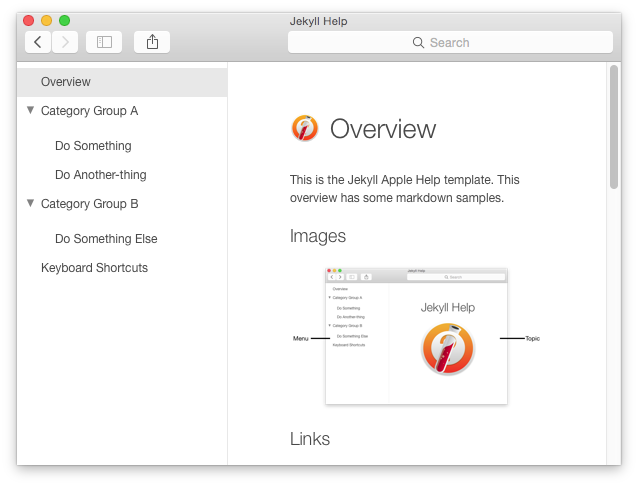

# Jekyll Apple Help

## Requirements

- [Xcode](https://developer.apple.com/xcode/)
- [Jekyll](http://jekyllrb.com) (both standard install and [RVM](https://rvm.io) supported)

Optional: [fswatch](http://brewformulas.org/Fswatch) for auto-refresh via jekyll-server.command

## Setup

The JekyllHelp template is designed for easy installation into a typical Xcode project. By default, the template's Info.plist expects the project and app to have the same name (e.g. MyApp.xcodeproj builds MyApp.app).

In the following, substitute your app/company for "MyApp"/"com.mycompany".

### Create MyAppHelp Bundle Target

0. Select _File > New > Target..._
0. Select Bundle template from _OS X > Frameworks & Libraries_
0. Enter the settings:
    - Product Name: MyAppHelp
    - Bundle Extension: help
0. Replace Xcode-generate MyAppHelp folder with JekyllHelp (renamed to MyAppHelp)
0. Update Bundles identifier to `com.mycompany.*`
0. Add a Run-Script Build-Phase with the script:
	`/usr/bin/make -C $(dirname "$PRODUCT_SETTINGS_PATH")`

Now the MyAppHelp target should build, creating the product `MyAppHelp.help`

### Integrate Help into MyApp Target

0. Add target MyAppHelp to MyApp's target dependencies (_Build Phases > Target Dependencies_)
0. Add product MyAppHelp.help to app target (via File Inspector)
0. Add to MyApp target Info properties:
	- Help Book Identifier: `com.mycompany.$(PROJECT_NAME:rfc1034identifier).help`
	- Help Book directory name: `$(PROJECT_NAME)Help.help`

## Authoring
